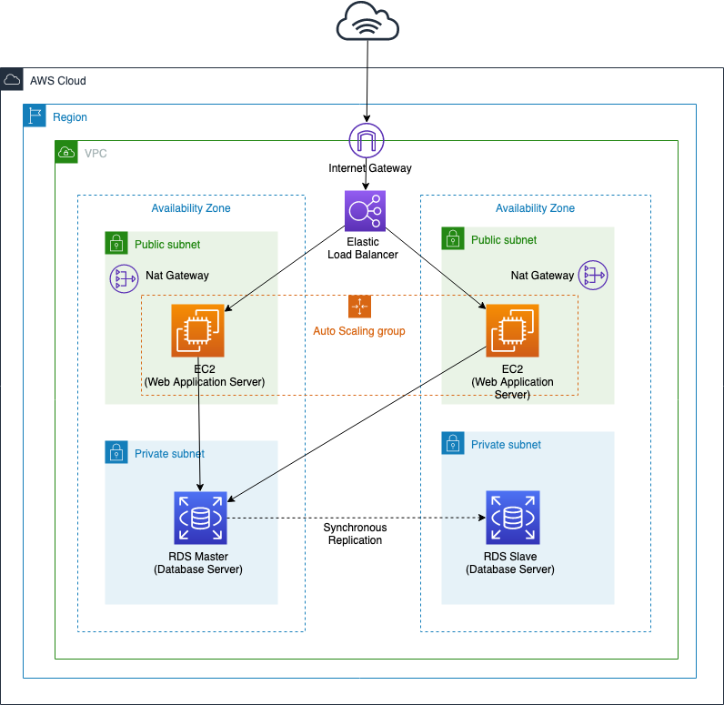

[](https://app.pulumi.com/new)

# 2-tier web application hosting example for AWS by Pulumi



## Requirements

- [Pulumi](https://www.pulumi.com/)
- [Node.js version 8 or later](https://nodejs.org/en/download/) for Typescript
- [AWS CLI](https://aws.amazon.com/cli/)

## Running the App

1.  Create a new stack:

    ```
    $ pulumi stack init dev
    ```

1.  Configure Pulumi to use an AWS region (e.g. `ap-northeast-1`).

    ```
    $ pulumi config set aws:region ap-northeast-1
    ```

1.  Configure VPC name (e.g. `custom`).

    ```
    $ pulumi config set vpcName custom
    ```

1.  Restore NPM modules via `npm install` or `yarn install`.

1.  Preview and deploy the app via `pulumi up`. The preview will take a few minutes, as it builds AWS resources.

    ```
    $ pulumi up
    ```

1.  View the endpoint URL, and run curl:

    ```bash
    $ pulumi stack output
    Current stack outputs (5):
    OUTPUT               VALUE
    dbEndpoint           custom-db88f9d77.ci8nicuewmmg.ap-northeast-1.rds.amazonaws.com:3306
    endpoint             custom-web-traffic-47d8937-127912046.ap-northeast-1.elb.amazonaws.com
    vpcId                vpc-00981f7c1edce2fc9
    vpcPrivateSubnetIds  ["subnet-00f91f31676f3e68f","subnet-000c75b604d53f769"]
    vpcPublicSubnetIds   ["subnet-06181aea4c5005556","subnet-06df87b193dd89922"]

    $ curl $(pulumi stack output endpoint)
    <html><head>Hello world</head><body><h1>Hello, World! from ap-northeast-1a</h1></body></html>
    ```

## Clean up

To clean up resources, run `pulumi destroy` and answer the confirmation question at the prompt.
To clean up a stack, run `pulumi stack rm` and answer the confirmation question at the prompt.


## License

MIT